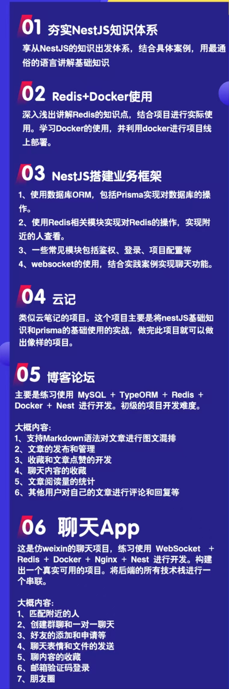

# 关于课程

#### 适用人群：

- 想积累项目经验，提高简历亮点的学生
- 想接单赚外快的在职程序员
- 想摆脱打工困境做独立开发者的程序员
- 想前端转全栈

#### 课程亮点：

- 这可能是市面上能找到的最全面最细致的 node 全栈体系课程了
- 使用最优秀的 nestjs 框架做为后端技术栈，天然的支持 TS
- 后端技术栈成体系（mysql、prisma、docker、redis）
- 三个实战项目从基础到进阶

## 详细介绍

