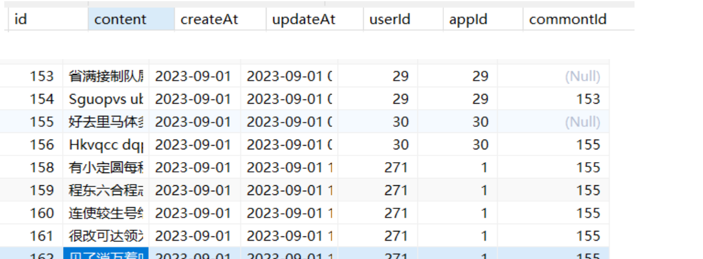
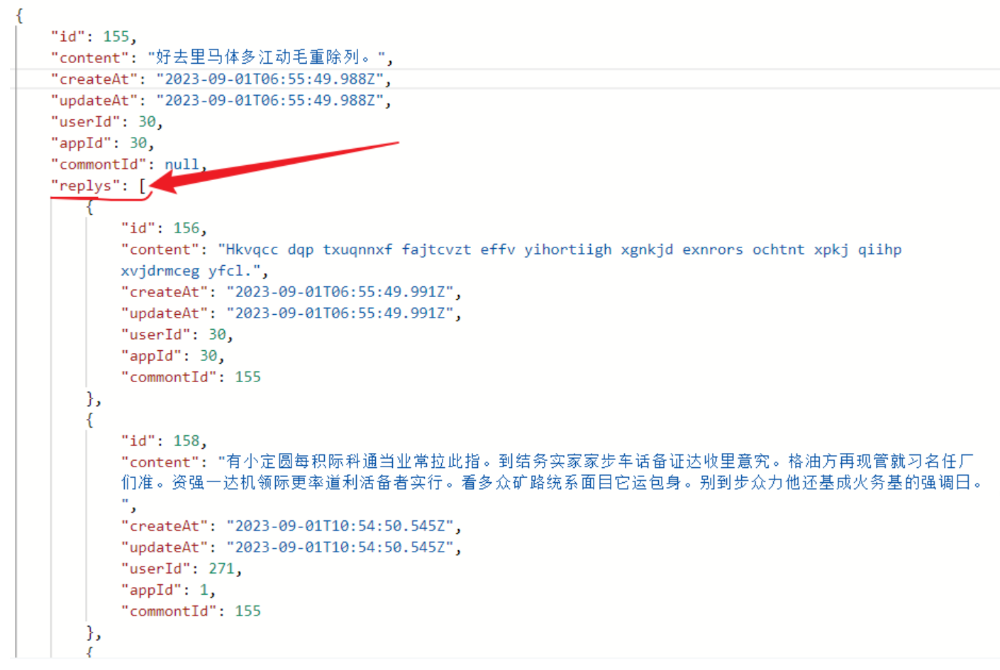

## 1、创建 model

> 使用自引用评论和评论的回复这两个字段可以放进一个表中，使用@relation 通过在回复中的 commontId 与评论的 id 进行关联，创建后的表结构如下，其中 id 为 155 的是一条对软件的评论，其后的几条评论都是对 id155 的回复，可见回复后面多了 commonId 字段用来关联 id
> 

> model 中的 replys 是对 momo'yi'tia 一条评论的所用回复，这么说有点抽象，查询出来的结构如下:
> 

```ts
model Commont {
  id        Int       @id @default(autoincrement())
  content   String
  createAt  DateTime  @default(now())
  updateAt  DateTime  @updatedAt
  // 发布者
  user      User      @relation(fields: [userId], references: [id], onDelete: Cascade)
  userId    Int
  // 评论对应的app
  app       App       @relation(fields: [appId], references: [id], onDelete: Cascade)
  appId     Int
  // 回复
  commontId Int?
  reply     Commont?  @relation("replys", fields: [commontId], references: [id], onDelete: Cascade)
  replys    Commont[] @relation("replys")
}
```

## 2、seed 数据填充

> 其中 connect 表示与某个属性进行关联

```ts
const commont = async () => {
  for (let i = 1; i <= 30; i++) {
    const res = await prisma.commont.create({
      data: {
        content: Random.csentence(),
        user: { connect: { id: i } },
        app: { connect: { id: i } },
      },
    });
    await prisma.commont.create({
      data: {
        content: Random.sentence(),
        user: { connect: { id: i } },
        app: { connect: { id: i } },
        reply: { connect: { id: res.id } },
      },
    });
  }
};
```
